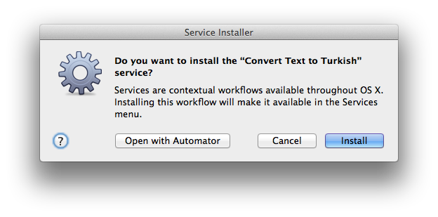

# Türkçe Deasciifier

Deasciifier yabancı metinleri Türkçeye çevirmenize yarayan bir uygulamadır.

## Gereksinimler

- Mac OS X
- node / npm

## Yükeleme

```bash
npm install deasciifier -g
```

Yükleme yaptıktan sonra, aşağıdaki pencereye onay verin:



## Lisans

MIT

---
Turkish text deasciifier and asciifier JavaScript library.
Deasciifier code directly converted by Mustafa Emre Acer from 
Dr. Deniz Yuret's Emacs Turkish Extension: http://www.denizyuret.com/turkish

